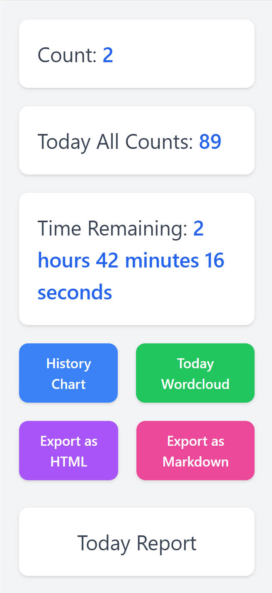
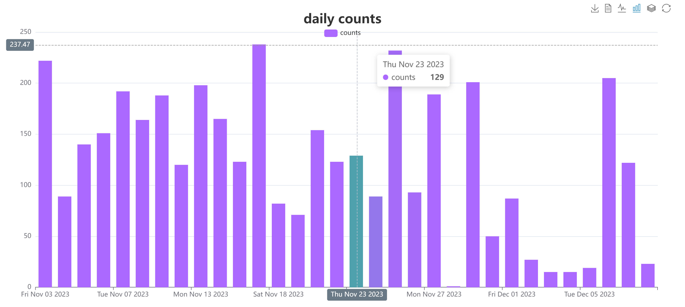
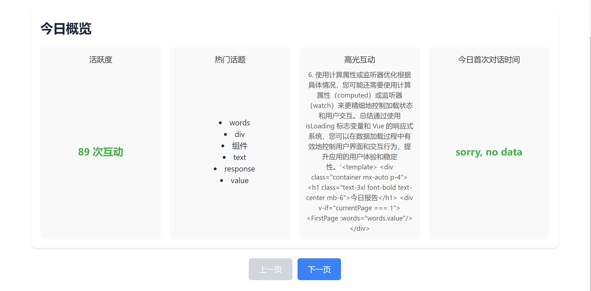

[English](README_en.md)|[中文](README.md)

# GPT-4 请求计数插件

一个用于统计每天向 GPT-4 发送请求次数的Chrome插件（只对浏览器有效，原理是识别网页上的文字变化），同时提供历史图表查询和当天对话词云图功能。

## 功能

- **请求计数**：插件通过监测浏览器活动中与 GPT-4 的交互，实时更新并显示当天的请求计数。
- **历史图表查询**：历史图表功能允许用户通过直观的图表形式回顾过去每天的请求次数。
- **当天对话词云图**：当天对话词云图通过分析用户当天的对话内容，生成代表这些对话的关键词的可视化图形。用户可以通过点击按钮下载词云图。
- **导出今日对话内容**
- **今日对话总结报告**：提供更多数据分析，洞见

## 安装

1. 从 [Google Chrome Web Store](https://chromewebstore.google.com/detail/gpt4-requests-counter/mfgcmmfakhajkaoeejceadlddfoikmap) 下载和安装插件。

## 使用方法

1. 点击插件图标，查看今天的请求计数。
2. 点击“history chat”按钮，查看历史图表。
3. 点击“today wordcloud”按钮，生成和下载今天的对话词云图。
4. export as HTML/Markdown 导出今日对话
5. 点击today report查看今日报告

## 截图

<!--  -->

## 贡献

欢迎提出改进建议和提交 PR！

## 许可证

MIT

## 联系

- Email: liuweiqing147@gmail.com
