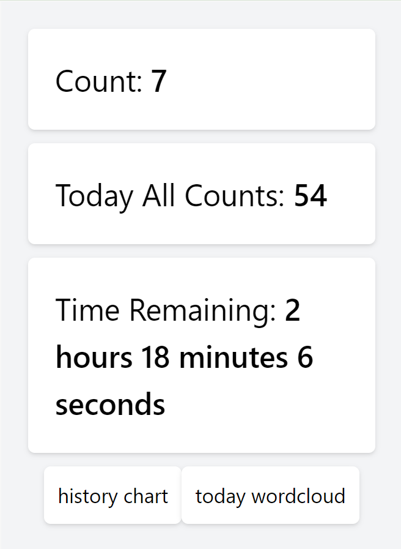

# GPT-4 请求计数插件

一个用于统计每天向 GPT-4 发送请求次数的Chrome插件（只对浏览器有效，原理是识别网页上的文字变化），同时提供历史图表查询和当天对话词云图功能。

## 功能

- **请求计数**：实时统计每天向 GPT-4 发送的请求次数。
- **历史图表查询**：查看过去每天的请求次数。
- **当天对话词云图**：生成表示当天对话内容的词云图，并提供下载功能。

## 安装

1. 从 [Google Chrome Web Store](https://chromewebstore.google.com/detail/gpt4-requests-counter/mfgcmmfakhajkaoeejceadlddfoikmap?hl=en-US&utm_source=ext_sidebar) 下载和安装插件。
2. 或者从 GitHub 仓库下载源代码，并在 Chrome 的 `chrome://extensions/` 页面中以开发者模式加载解压后的文件夹。

## 使用

1. 点击插件图标，查看今天的请求计数。
2. 点击“history chat”按钮，查看历史图表。
3. 点击“today wordcloud”按钮，生成和下载今天的对话词云图。

## 截图

## 贡献

欢迎提出改进建议和提交 PR！请确保更新了 README 以及相关的文档。

## 许可证

MIT

## 联系

- Email: liuweiqing147@gmail.com

