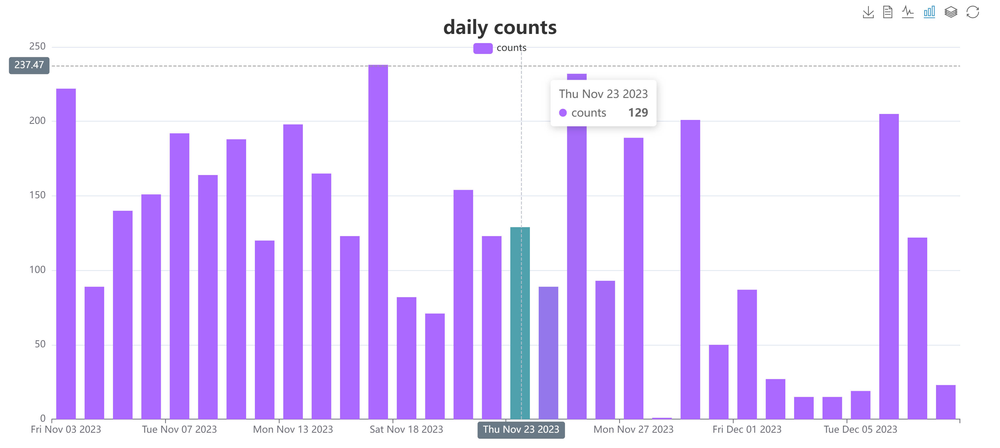
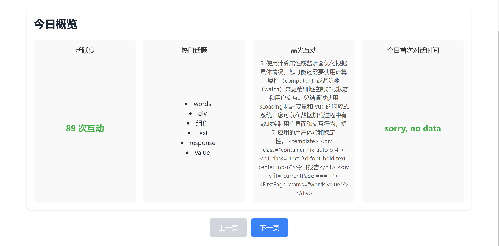

[English](README_en.md)|[中文](README.md)

# GPT-4 Request Counter Extension

A Chrome extension designed to count the number of requests sent to GPT-4 each day (effective only in the browser, based on detecting text changes on web pages). It also offers features like historical data charts and a word cloud for the day's conversations.

## Features

- **Request Counting**: The extension monitors interactions with GPT-4 within the browser, providing real-time updates and displaying the count of requests made for the current day.
- **Historical Data Chart**: This feature allows users to view past daily request counts through an intuitive chart.
- **Daily Conversation Word Cloud**: Generates a word cloud visualizing the day's conversation content, with a download option for the generated word cloud.
- **Export Today's Conversation**: Options to export the conversation in HTML/Markdown formats.
- **Daily Conversation Summary Report**: Offers deeper data analysis and insights into the day's interactions.

## Installation

1. Download and install the extension from the [Google Chrome Web Store](https://chromewebstore.google.com/detail/gpt4-requests-counter/mfgcmmfakhajkaoeejceadlddfoikmap).
2. Alternatively, download the source code from the GitHub repository and load it in developer mode on the `chrome://extensions/` page in Chrome, after unzipping the downloaded folder.

## How to Use

1. Click on the extension icon to view the count of today's requests.
2. Click the “history chat” button to view the historical data chart.
3. Click the “today wordcloud” button to generate and download the word cloud for today's conversation.
4. Export today's conversation as HTML or Markdown.
5. Click the "today report" to view today's comprehensive report.

## Screenshots

<!--  -->

## Contribution

Suggestions for improvements and PR submissions are welcome!

## License

MIT

## Contact

- Email: liuweiqing147@gmail.com
